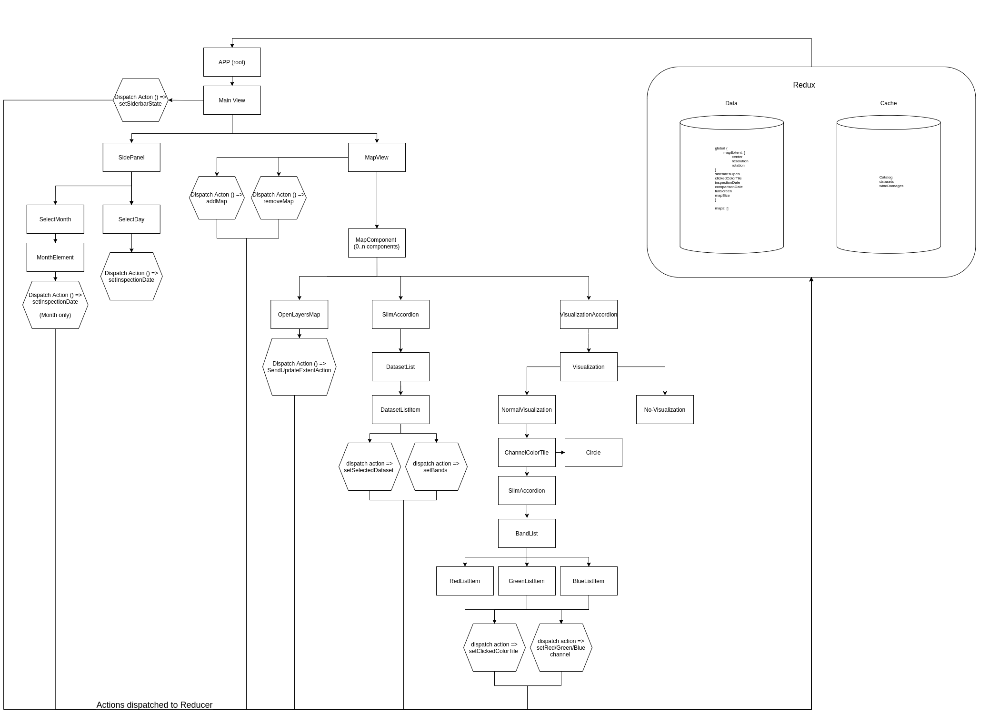
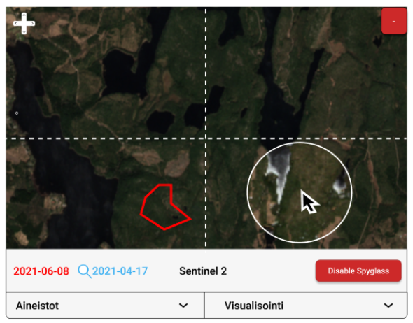
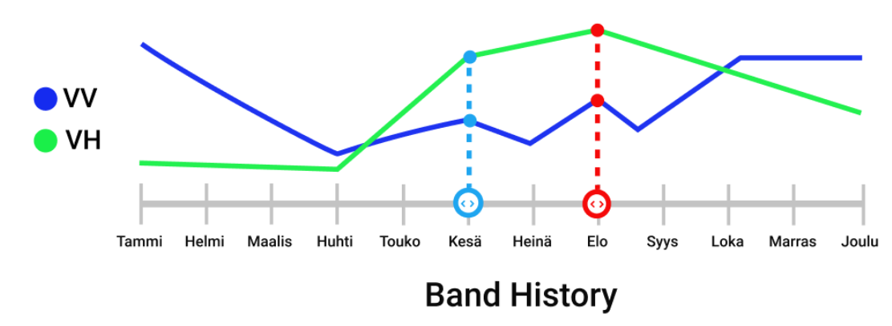

# Tuulituhohaukka APP

This project was bootstrapped with [Create React App](https://github.com/facebook/create-react-app). This readme covers the most used commands, but you can read more about create react app to find other functionality available in this project.

The app is in the directory `app/`. To start developing the app, you need to enter that directory and first install the dependencies: `npm install`

## Devcontainer

This application uses VSCode devcontainers to normalize the development environment. The project may however be developed and built also without devcontainers. However using the devcontainer guarantees that every developer is using the same development and build environment.

You can read more about devcontainers [here](https://code.visualstudio.com/docs/remote/containers).

## Running in development mode

You can run the development server via npm. This will start the server and any changes to the code will be hot deployed into the browser. The process will open a browser window pointing to the development server automatically.

`npm start`

## Building the application

Building the application will combine all necessary javascript dependencies and build a static version of the tool. The results will be in the `build/` folder:

`npm run build`

# Implementation details

## React app

The application uses redux for state management. The react application structure is documented here:

## Dependencies

The application is built with React/Redux and the following key components:
* OpenLayers for maps
* MaterialUI for layout and basic components
* MaterialUI picker for the calendar component
* react-chartjs-2 for a 12-month overall view

## Data sources

Backends and APIs used by the application:
* FMI STAC catalogue built for this application (app/src/API/Api.ts): https://pta.data.lit.fmi.fi/stac/root.json
* Finnish Forest Centre ArcGIS REST for reading the number of wind damage reports (app/src/API/Tuulituhot.ts): https://aineistot.metsakeskus.fi/metsakeskus/rest/services/Metsatieto/MKItuhot/FeatureServer/0/query/

The data for wind damages and the catalogue are read lazily from the APIs when necessary.

## Known problems

To enable the visualisation settings that allow users to choose how bands are visualized, OpenLayers is using WebGL TileLayers. However due to how the features is written in OpenLayers, each TileLayer requires an individual WebGL context. This means that each item visible on a map, OpenLayers uses one WebGL context. These contexts are a limited resource within a browser and this hard limit is shared between all tabs/windows open. This means that having too many items visible (which is especially problematic with Sentine 1 raw imagery, "osakuvat") will cause issues. These issues can range from 1) not all of the items being drawn, 2) other map windows might stop working (due to their context being "stolen" by another window), 3) Tuulituhohaukka interfering with other application in the browser, such as Google Maps, 4) other applications in the browser may interfere with Tuulituhohaukka.

A bug report has been filed with OpenLayers: https://github.com/openlayers/openlayers/issues/12800

# Future development

This version of the Tuulituhohaukka is an MVP version that is still missing some features that are planned to be added later on. The main future features are: spyglass (or lens) and timeseries components.

## Spyglass / Lens

The lens is a tool that can be used on map windows. When active, a circular area surrounding the mouse cursor, will show a different layer (or set of layers) than when outside this area. This tool is used to compare changes between two versions of the dataset. In this application, these two versions are defined and selected based on time. Inspection time is the main date selection of the application and that controls which versions of each dataset in the visible maps is shown. A secondary time selection ("comparison date") is required for the lens. 

Implementation notes:
* For the actual tool: adapt the layer-spy example from OpenLayers (https://openlayers.org/en/latest/examples/layer-spy.html)
* The method of choosing the image to show based on dataset and date must be designed.
    * Currently, each window shows the image for that dataset based on inspection time and the date is chosen based on "current or previous" (meaning that if there is a mosaic that covers that day, that will be shon. if not, the latest previous version is chosen).
    * For the lens, we probably would use the "next" strategy (meaning the one that covers the earliest period that is after the comparison date).
    * Relevant code: `src/API/Api.ts:getItemsForDatasetAndTime()`
* For selecting the comparison date:
    * Using the strategy above, the application can work well by just using a comparisonDate equal to inspectionDate (=> the strategies will pick out different datasets that "surround" the chosen inspection time)
    * However a method to select the comparison date manually may need to be developed. A good place for this could be the time series tool, see below
    * Each map window might need their individual comparison time settings as the time frequency of different datasets vary greatly

Practical implementation:
* The MapComponent should retrieve items for both the inspectionDate (strategy: current or previous) and comparison date (strategy: next)
* The MapComponent needs to bind both sets of items to the OpenLayersMap component - separately so OpenLayersMap can determine which is which
* The OpenLayersMap needs to build TileLayers for both sets of items
* The OpenLayersMap needs to adapt the layer-spy example that controls the alpha channel of the inspectionDate layers based on the position of the mousecursor
* The MapComponent potentially needs a control to enable/disable the lens tool

## Time series

The time series tool will show how the value of a dataset develops over time. The values are picked from the center of the map where the crosshairs of the map are.

Implementation notes:
* The tool will open a chart below the map. The chart shows a line chart of each visible (the bands the user has chosen to be visible) band over time
* The time series are colored with the same color as that band is drawn on the map. If the same band is set for multiple colors, this same mix of colors is used for that band.
* Selected inspection time and comparison time are visualised on the chart
* The user may choose the comparison time using this chart (by for example dragging the comparison time marker)
* The chart will show N timesteps. The actual steps are defined by what steps are available in the chosen dataset for that period.

Practical implementation:
* `app/src/API/Api.ts` needs functionality that will return the N timesteps surrounding inspectionTime for a dataset. These steps should center on inspectionTime and the resulting data should be 1) grouped into timesteps, and 2) each group should contain all item information for that timestep
* A new component needs to be written within `app/src/Components/Map/` that shows the chart
* Geotiff.js (already a depenency) needs to be used to read the pixel value information from the items. For this, a new API module should be developed, for example: `app/src/API/TimeSeries.ts`. This component should provide an easy to use API that matches the requirement from the React component (most likely: `retrieveTimeSeries(timestepsContainingItems, centerCoordinate, crs) : Promise<AllChartData>) and internally needs to have an API which retrieves a pixel value for a given coordinate (or geographic area surrounding a coordinate - see considerations below) from a single item.
* It is important to ensure that the crosshairs actually point at the center of the map. Current implementation is HTML and CSS and while it always points to the same place in each map, it might not be always centered in the absolute center of the map.

Advanced:
* The dataset catalouge files could contain information about which unit the pixel values are. This could then be used in the chart to give the user perspective on what the values in the chart are.

Important considerations:
* Should the values for the timeseries y axis be calculated from a single pixel in the original image, or using some sort of averaging over a geographical area?

